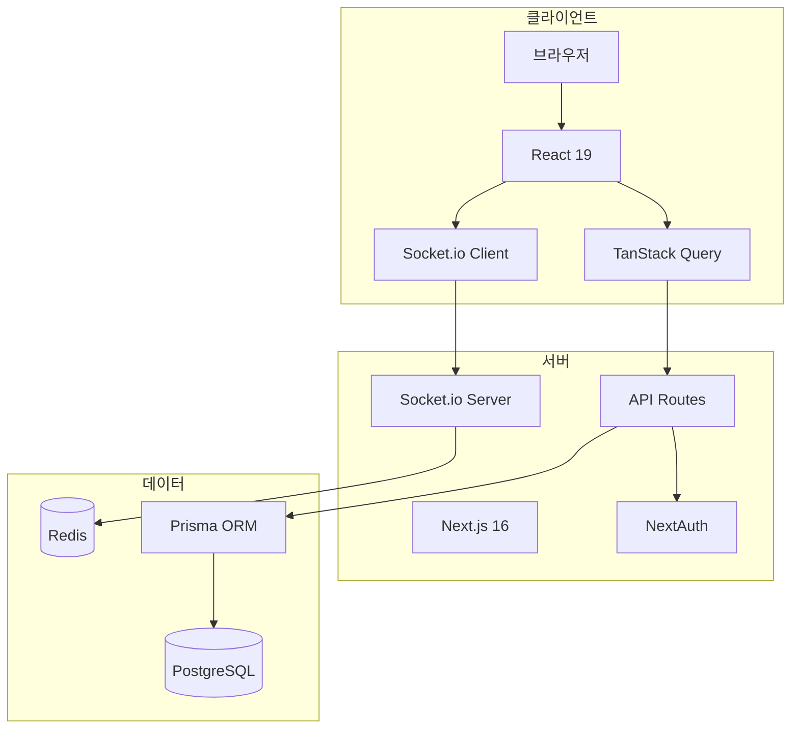

# 🛠️ 기술 스택

## 📋 개요

CoUp은 최신 웹 기술 스택을 사용하여 구축된 풀스택 애플리케이션입니다. Next.js를 중심으로 프론트엔드와 백엔드가 통합되어 있습니다.

---

## 🎨 Frontend (프론트엔드)

### 핵심 프레임워크

| 기술 | 버전 | 용도 |
|------|------|------|
| **Next.js** | 16.0.1 | React 기반 풀스택 프레임워크 |
| **React** | 19.2.0 | UI 라이브러리 |
| **React DOM** | 19.2.0 | DOM 렌더링 |

### 스타일링

| 기술 | 버전 | 용도 |
|------|------|------|
| **TailwindCSS** | 4.x | 유틸리티 기반 CSS 프레임워크 |
| **PostCSS** | - | CSS 후처리기 |

### 상태 관리

| 기술 | 버전 | 용도 |
|------|------|------|
| **TanStack Query** | 5.90.10 | 서버 상태 관리, 캐싱 |
| **React Context** | 내장 | 전역 상태 (설정, 소켓) |

### UI 컴포넌트

| 기술 | 버전 | 용도 |
|------|------|------|
| **Recharts** | 3.5.1 | 차트 및 데이터 시각화 |
| **React Toastify** | 11.0.5 | 토스트 알림 |
| **React Markdown** | 10.1.0 | 마크다운 렌더링 |

---

## 🖥️ Backend (백엔드)

### 서버 프레임워크

| 기술 | 버전 | 용도 |
|------|------|------|
| **Next.js API Routes** | 16.0.1 | RESTful API 엔드포인트 |
| **Node.js** | - | 서버 런타임 |

### 데이터베이스

| 기술 | 버전 | 용도 |
|------|------|------|
| **PostgreSQL** | - | 관계형 데이터베이스 |
| **Prisma** | 6.19.0 | ORM (Object-Relational Mapping) |
| **Prisma Client** | 6.19.0 | 데이터베이스 클라이언트 |

### 인증

| 기술 | 버전 | 용도 |
|------|------|------|
| **NextAuth.js** | 4.24.13 | 인증 프레임워크 |
| **@auth/prisma-adapter** | 2.11.1 | Prisma DB 연동 어댑터 |
| **bcryptjs** | 3.0.3 | 비밀번호 해싱 |
| **jsonwebtoken** | 9.0.2 | JWT 토큰 생성/검증 |

---

## 🔄 실시간 통신

| 기술 | 버전 | 용도 |
|------|------|------|
| **Socket.io** | 4.8.1 | 실시간 양방향 통신 (서버) |
| **Socket.io-client** | 4.8.1 | 실시간 통신 클라이언트 |
| **Redis** | 5.9.0 | 세션 스토어, Socket.io 어댑터 |
| **@socket.io/redis-adapter** | 8.3.0 | Socket.io Redis 연동 |

---

## 🔒 보안 & 검증

| 기술 | 버전 | 용도 |
|------|------|------|
| **Zod** | 4.1.12 | 스키마 기반 데이터 검증 |
| **sanitize-html** | 2.17.0 | XSS 방지 HTML 정화 |

---

## 🧪 테스팅

| 기술 | 버전 | 용도 |
|------|------|------|
| **Jest** | 30.2.0 | 테스트 러너 |
| **jest-environment-jsdom** | 30.2.0 | 브라우저 환경 시뮬레이션 |
| **React Testing Library** | 16.3.0 | 컴포넌트 테스트 |
| **@testing-library/jest-dom** | 6.9.1 | DOM 매처 확장 |
| **@testing-library/user-event** | 14.6.1 | 사용자 이벤트 시뮬레이션 |

---

## 🔧 개발 도구

| 기술 | 버전 | 용도 |
|------|------|------|
| **ESLint** | 9.x | 코드 린팅 |
| **eslint-config-next** | 16.0.1 | Next.js ESLint 규칙 |
| **babel-plugin-react-compiler** | 1.0.0 | React 컴파일러 플러그인 |

---

## 📦 유틸리티

| 기술 | 버전 | 용도 |
|------|------|------|
| **nanoid** | 5.1.6 | 고유 ID 생성 |
| **dotenv** | 17.2.3 | 환경 변수 관리 |
| **winston** | 3.18.3 | 로깅 |
| **remark-gfm** | 4.0.1 | GitHub Flavored Markdown 지원 |

---

## 🏗️ 아키텍처 다이어그램

---

## 📝 버전 선택 이유

### Next.js 16
- App Router 완전 지원
- React 19 호환
- 서버 컴포넌트 최적화

### React 19
- 최신 Concurrent 기능
- 향상된 서버 컴포넌트
- React Compiler 지원

### Prisma 6
- TypeSafe 쿼리
- 직관적인 스키마 정의
- 자동 마이그레이션

### TanStack Query 5
- 강력한 캐싱
- 낙관적 업데이트
- 자동 재검증

---

## 🔗 관련 문서

- [프로젝트 소개](./project-introduction.md)
- [폴더 구조](./folder-structure.md)
- [시스템 아키텍처](../02_architecture/system-overview.md)
