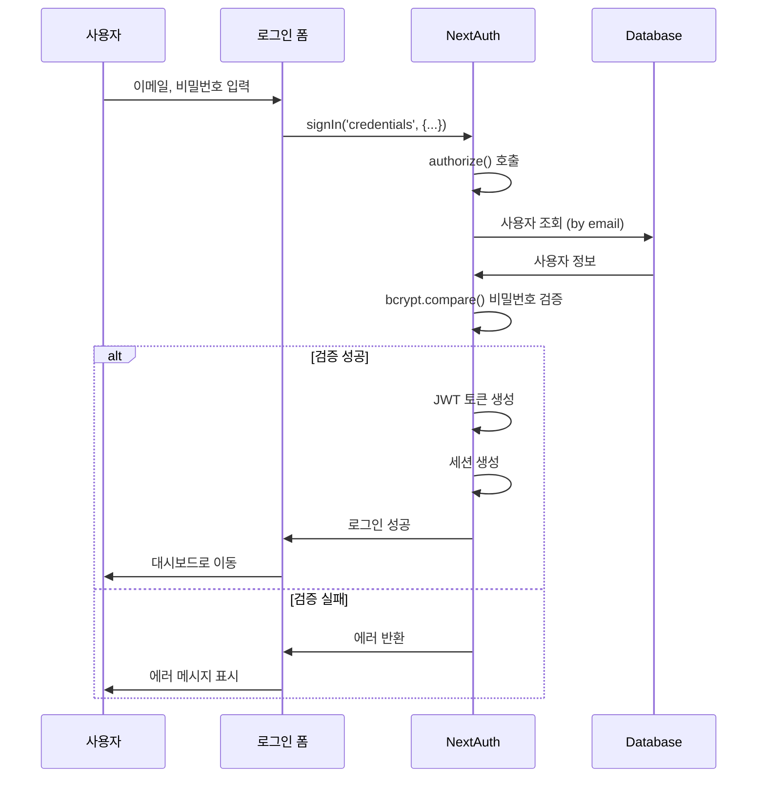
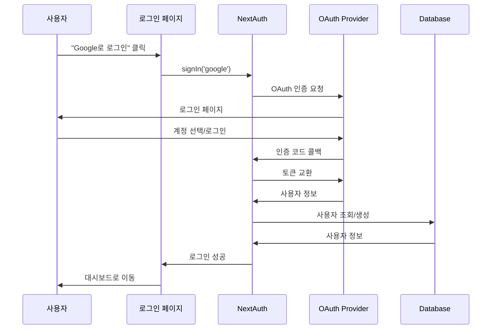
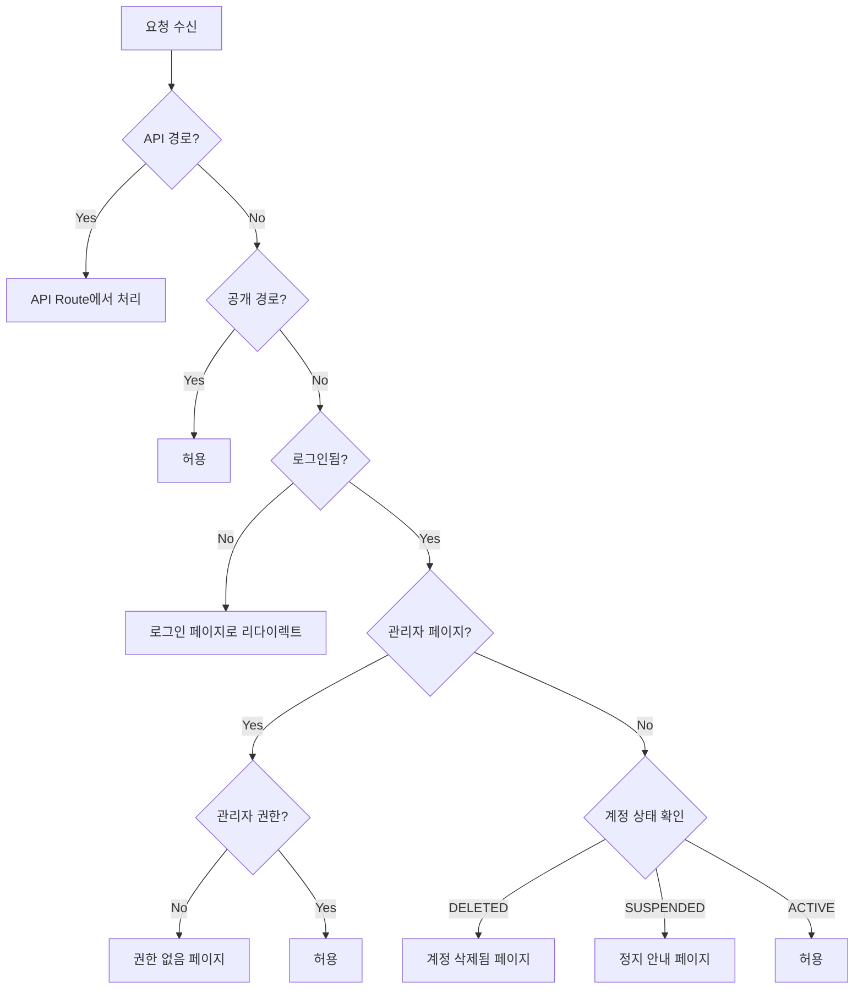
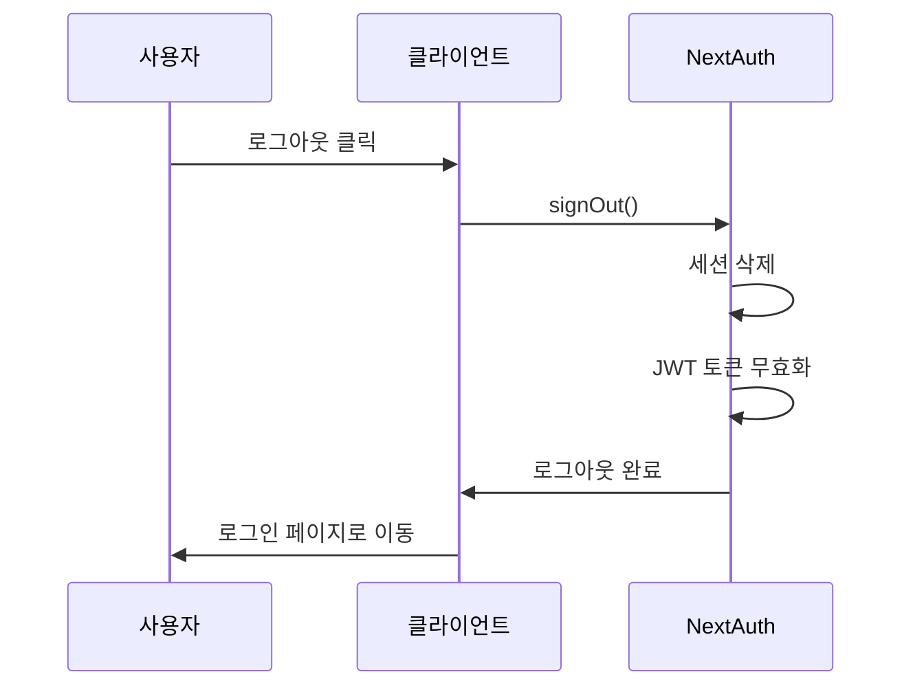

# 🔐 인증 흐름

## 📋 개요

CoUp은 NextAuth.js를 사용하여 인증을 처리합니다. 이메일/비밀번호 로그인과 소셜 로그인(Google, GitHub)을 지원합니다.

---

## 🔑 인증 방식

| 방식 | Provider | 설명 |
|------|----------|------|
| **이메일/비밀번호** | CredentialsProvider | 기본 로그인 방식 |
| **Google** | GoogleProvider | Google OAuth 2.0 |
| **GitHub** | GitHubProvider | GitHub OAuth |

---

## 🔄 로그인 흐름

### 이메일/비밀번호 로그인



### 소셜 로그인 (OAuth)



---

## 🛡️ 미들웨어 인증

### middleware.js 처리 흐름



### 공개 경로

```javascript
const publicPaths = [
  '/',           // 랜딩 페이지
  '/sign-in',    // 로그인
  '/sign-up',    // 회원가입
  '/privacy',    // 개인정보처리방침
  '/terms',      // 이용약관
];
```

### 보호된 경로

| 경로 | 필요 권한 |
|------|----------|
| `/dashboard` | 로그인 필수 |
| `/my-studies/*` | 로그인 필수 |
| `/studies/*` | 로그인 필수 (목록은 공개) |
| `/admin/*` | 관리자 권한 |
| `/settings/*` | 로그인 필수 |

---

## 👤 세션 구조

### JWT 토큰 페이로드

```javascript
{
  id: "user-id",
  email: "user@example.com",
  name: "사용자명",
  image: "avatar-url",
  role: "USER",           // USER | ADMIN
  status: "ACTIVE",       // ACTIVE | SUSPENDED | DELETED
  provider: "CREDENTIALS" // CREDENTIALS | GOOGLE | GITHUB
}
```

### Session 객체

```javascript
{
  user: {
    id: "user-id",
    email: "user@example.com",
    name: "사용자명",
    image: "avatar-url",
    role: "USER",
    status: "ACTIVE",
    provider: "CREDENTIALS"
  },
  expires: "2026-02-28T12:00:00.000Z"
}
```

---

## 🔒 권한 체계 (RBAC)

### 역할 (Roles)

| 역할 | 설명 | 권한 |
|------|------|------|
| `USER` | 일반 사용자 | 스터디 참여, 채팅, 파일 업로드 |
| `ADMIN` | 관리자 | 사용자 관리, 스터디 관리, 신고 처리 |

### 관리자 세부 역할 (AdminRole)

| 역할 | 설명 |
|------|------|
| `VIEWER` | 조회만 가능 |
| `MODERATOR` | 콘텐츠 모더레이션 |
| `ADMIN` | 사용자/스터디 관리 |
| `SUPER_ADMIN` | 모든 권한 |

### 권한 확인 방법

#### 서버 (API Route)

```javascript
// src/app/api/admin/[...]/route.js
import { getServerSession } from "next-auth";
import { authConfig } from "@/lib/auth";

export async function GET(request) {
  const session = await getServerSession(authConfig);
  
  if (!session) {
    return Response.json({ error: "인증 필요" }, { status: 401 });
  }
  
  // 관리자 권한 확인
  const adminRole = await prisma.adminRole.findUnique({
    where: { userId: session.user.id }
  });
  
  if (!adminRole) {
    return Response.json({ error: "권한 없음" }, { status: 403 });
  }
  
  // 처리...
}
```

#### 클라이언트

```javascript
'use client';
import { useSession } from 'next-auth/react';

function AdminButton() {
  const { data: session } = useSession();
  
  if (session?.user?.role !== 'ADMIN') {
    return null;
  }
  
  return <button>관리자 메뉴</button>;
}
```

---

## 📊 NextAuth 설정

### authConfig 주요 설정

```javascript
// src/lib/auth.js
export const authConfig = {
  adapter: PrismaAdapter(prisma),
  
  providers: [
    CredentialsProvider({
      credentials: {
        email: { label: "Email", type: "email" },
        password: { label: "Password", type: "password" }
      },
      async authorize(credentials) {
        // 1. 입력 검증
        // 2. 사용자 조회
        // 3. 비밀번호 검증
        // 4. 계정 상태 확인
        // 5. 사용자 정보 반환
      }
    }),
  ],
  
  callbacks: {
    async jwt({ token, user, trigger, session }) {
      // JWT 토큰에 사용자 정보 추가
      if (user) {
        token.id = user.id;
        token.role = user.role;
        token.status = user.status;
        token.provider = user.provider;
      }
      return token;
    },
    
    async session({ session, token }) {
      // 세션에 토큰 정보 복사
      session.user.id = token.id;
      session.user.role = token.role;
      session.user.status = token.status;
      session.user.provider = token.provider;
      return session;
    },
    
    async redirect({ url, baseUrl }) {
      // 리다이렉트 URL 처리
      if (url.startsWith('/')) return `${baseUrl}${url}`;
      if (url.startsWith(baseUrl)) return url;
      return `${baseUrl}/dashboard`;
    }
  },
  
  pages: {
    signIn: '/sign-in',
    signUp: '/sign-up',
    error: '/sign-in',
  },
  
  session: {
    strategy: 'jwt',
    maxAge: 24 * 60 * 60, // 24시간
  }
};
```

---

## 🔐 비밀번호 보안

### 해싱

```javascript
import bcrypt from 'bcryptjs';

// 회원가입 시 비밀번호 해싱
const hashedPassword = await bcrypt.hash(password, 10);

// 로그인 시 비밀번호 검증
const isValid = await bcrypt.compare(inputPassword, hashedPassword);
```

### 비밀번호 정책

| 규칙 | 조건 |
|------|------|
| 최소 길이 | 8자 이상 |
| 최대 길이 | 100자 이하 |
| 필수 문자 | 영문, 숫자 조합 권장 |

---

## 🚪 로그아웃 흐름



---

## 🔗 관련 문서

- [시스템 개요](./system-overview.md)
- [사용자 모델](../03_database/models/user.md)
- [관리자 모델](../03_database/models/admin.md)
- [미들웨어 설정](../11_configuration/README.md)
