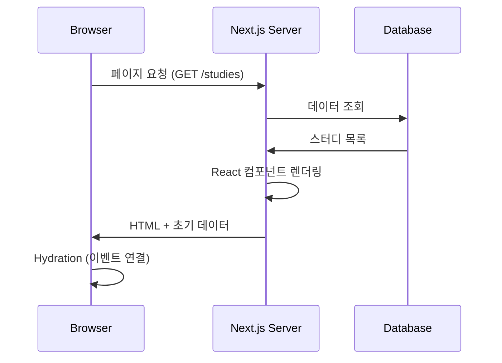
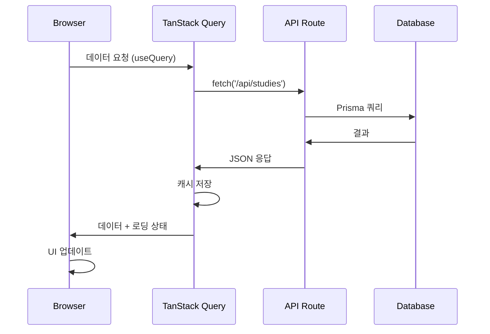
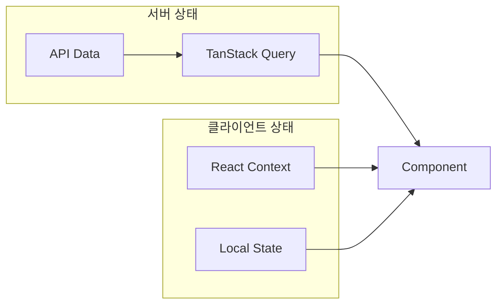
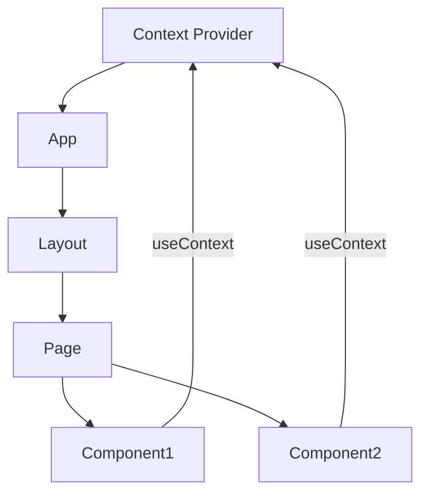
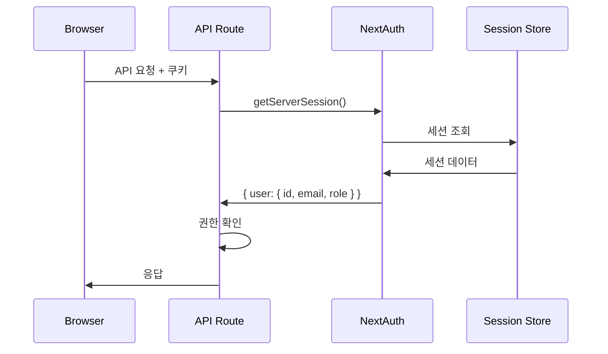

# 🔄 데이터 흐름

## 📋 개요

이 문서는 CoUp에서 데이터가 어떻게 흐르는지 설명합니다. 페이지 렌더링, API 호출, 상태 관리, 캐싱 전략을 포함합니다.

---

## 🖥️ 페이지 렌더링 흐름

### SSR (Server-Side Rendering)



**사용 사례:**
- 초기 페이지 로드
- SEO가 중요한 페이지
- 서버 컴포넌트

### CSR (Client-Side Rendering)



**사용 사례:**
- 사용자 인터랙션 후 데이터 로드
- 실시간 데이터 갱신
- 클라이언트 컴포넌트

---

## 📊 TanStack Query 캐싱 전략

### Query Keys 구조

```javascript
// 계층적 Query Key 구조
const queryKeys = {
  // 스터디
  studies: {
    all: ['studies'],
    list: (filters) => ['studies', 'list', filters],
    detail: (id) => ['studies', 'detail', id],
    members: (id) => ['studies', id, 'members'],
    messages: (id) => ['studies', id, 'messages'],
  },
  
  // 내 스터디
  myStudies: {
    all: ['my-studies'],
    detail: (id) => ['my-studies', id],
  },
  
  // 태스크
  tasks: {
    all: ['tasks'],
    byStudy: (studyId) => ['tasks', 'study', studyId],
    detail: (id) => ['tasks', 'detail', id],
  },
  
  // 알림
  notifications: {
    all: ['notifications'],
    unread: ['notifications', 'unread'],
  },
  
  // 사용자
  user: {
    current: ['user', 'current'],
    profile: (id) => ['user', 'profile', id],
  },
};
```

### 캐싱 설정

```javascript
// QueryClient 설정
const queryClient = new QueryClient({
  defaultOptions: {
    queries: {
      staleTime: 5 * 60 * 1000,      // 5분: 데이터가 "신선"한 시간
      gcTime: 30 * 60 * 1000,        // 30분: 캐시 유지 시간
      refetchOnWindowFocus: true,    // 탭 포커스 시 재요청
      refetchOnReconnect: true,      // 네트워크 재연결 시 재요청
      retry: 3,                      // 실패 시 3번 재시도
    },
  },
});
```

### 데이터 갱신 패턴

#### 1. 쿼리 무효화 (Invalidation)

```javascript
// 스터디 생성 후 목록 무효화
const createStudy = useMutation({
  mutationFn: (data) => fetch('/api/studies', { method: 'POST', body: JSON.stringify(data) }),
  onSuccess: () => {
    // 스터디 목록 캐시 무효화 → 자동 재요청
    queryClient.invalidateQueries({ queryKey: ['studies'] });
  },
});
```

#### 2. 낙관적 업데이트 (Optimistic Update)

```javascript
// 메시지 전송 시 즉시 UI 반영
const sendMessage = useMutation({
  mutationFn: (message) => fetch('/api/messages', { method: 'POST', body: JSON.stringify(message) }),
  
  // 요청 전 낙관적 업데이트
  onMutate: async (newMessage) => {
    await queryClient.cancelQueries({ queryKey: ['messages', studyId] });
    const previousMessages = queryClient.getQueryData(['messages', studyId]);
    
    // 임시로 새 메시지 추가
    queryClient.setQueryData(['messages', studyId], (old) => [
      ...old,
      { ...newMessage, id: 'temp', pending: true }
    ]);
    
    return { previousMessages };
  },
  
  // 실패 시 롤백
  onError: (err, newMessage, context) => {
    queryClient.setQueryData(['messages', studyId], context.previousMessages);
  },
  
  // 완료 후 실제 데이터로 교체
  onSettled: () => {
    queryClient.invalidateQueries({ queryKey: ['messages', studyId] });
  },
});
```

---

## 🔄 상태 관리 흐름

### 상태 유형별 관리



| 상태 유형 | 도구 | 예시 |
|-----------|------|------|
| **서버 상태** | TanStack Query | 스터디 목록, 사용자 프로필 |
| **전역 상태** | React Context | 소켓 연결, 사용자 설정 |
| **로컬 상태** | useState | 폼 입력, 모달 열림 |

### Context 데이터 흐름



---

## 📡 실시간 데이터 동기화

### Socket.io + TanStack Query 통합

```javascript
// 소켓 이벤트 수신 시 캐시 업데이트
useEffect(() => {
  if (!socket) return;
  
  // 새 메시지 수신
  socket.on('message', (message) => {
    queryClient.setQueryData(['messages', studyId], (old) => 
      [...old, message]
    );
  });
  
  // 멤버 상태 변경
  socket.on('member-status', (data) => {
    queryClient.invalidateQueries({ queryKey: ['studies', studyId, 'members'] });
  });
  
  return () => {
    socket.off('message');
    socket.off('member-status');
  };
}, [socket, studyId, queryClient]);
```

---

## 📊 API 요청/응답 형식

### 요청 형식

```javascript
// GET 요청 (조회)
fetch('/api/studies?category=programming&page=1')

// POST 요청 (생성)
fetch('/api/studies', {
  method: 'POST',
  headers: { 'Content-Type': 'application/json' },
  body: JSON.stringify({
    name: '스터디명',
    category: 'programming',
    description: '설명'
  })
})

// PATCH 요청 (수정)
fetch('/api/studies/xxx', {
  method: 'PATCH',
  headers: { 'Content-Type': 'application/json' },
  body: JSON.stringify({ name: '새 이름' })
})

// DELETE 요청 (삭제)
fetch('/api/studies/xxx', { method: 'DELETE' })
```

### 응답 형식

```javascript
// 성공 응답
{
  "success": true,
  "data": { /* 데이터 */ }
}

// 목록 응답 (페이지네이션)
{
  "success": true,
  "data": [ /* 목록 */ ],
  "pagination": {
    "page": 1,
    "limit": 20,
    "total": 100,
    "totalPages": 5
  }
}

// 에러 응답
{
  "success": false,
  "error": "에러 메시지",
  "code": "ERROR_CODE"
}
```

---

## 🔐 인증 데이터 흐름



---

## 🔗 관련 문서

- [시스템 개요](./system-overview.md)
- [인증 흐름](./authentication-flow.md)
- [실시간 통신](./realtime-communication.md)
- [상태 관리](../07_state_management/README.md)
