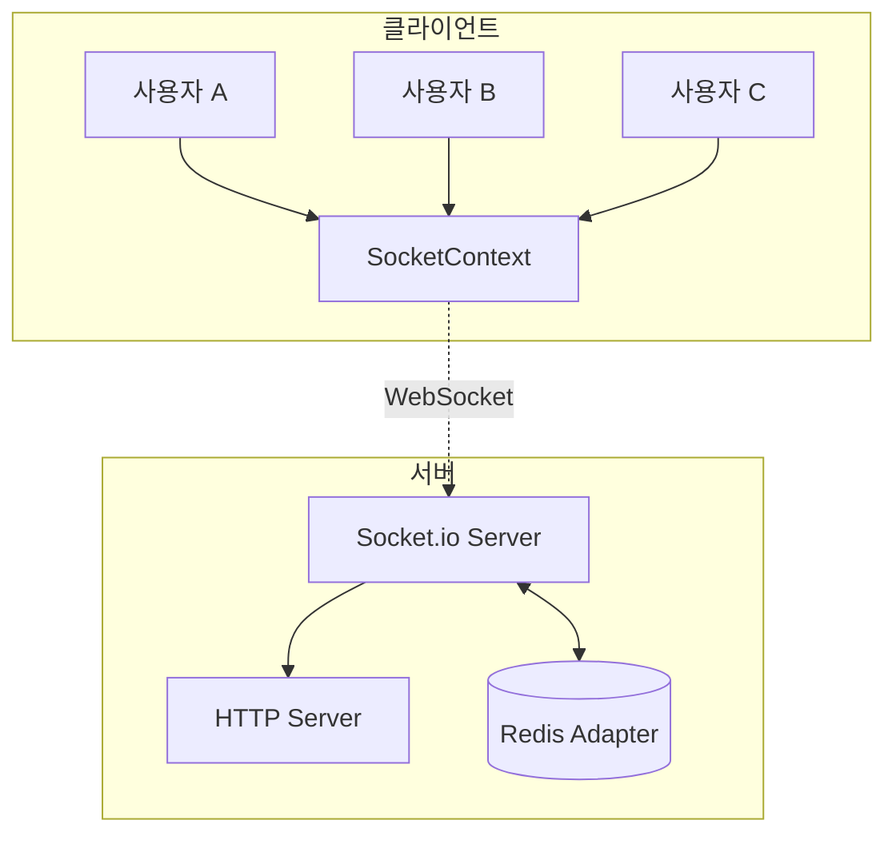
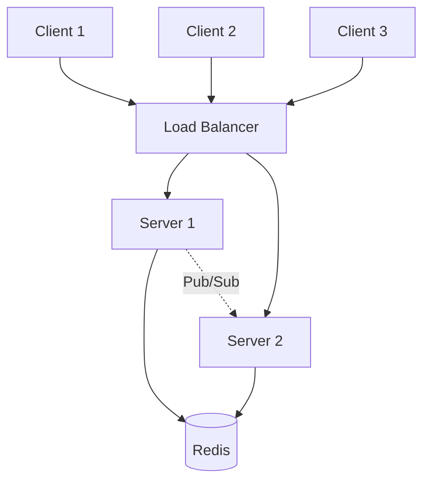

# 🔄 실시간 통신

## 📋 개요

CoUp은 Socket.io를 사용하여 실시간 양방향 통신을 구현합니다. 채팅, 알림, 사용자 상태 등 실시간 기능을 지원합니다.

---

## 🏗️ 아키텍처



---

## 🖥️ 서버 구성

### server.mjs (커스텀 서버)

```javascript
import { createServer } from 'http'
import next from 'next'
import { initSocketServer } from './src/lib/socket/server.js'

const app = next({ dev, hostname, port })
const handle = app.getRequestHandler()

app.prepare().then(async () => {
  const httpServer = createServer(async (req, res) => {
    await handle(req, res, parsedUrl)
  })

  // Socket.io 초기화
  await initSocketServer(httpServer)

  httpServer.listen(port, () => {
    console.log(`> Socket.io server initialized`)
  })
})
```

### Socket.io 서버 초기화

```javascript
// src/lib/socket/server.js
import { Server } from 'socket.io'
import { createAdapter } from '@socket.io/redis-adapter'
import { redis } from '@/lib/redis'

export async function initSocketServer(httpServer) {
  const io = new Server(httpServer, {
    cors: {
      origin: process.env.NEXT_PUBLIC_APP_URL,
      methods: ['GET', 'POST'],
      credentials: true
    },
    transports: ['websocket', 'polling']
  })

  // Redis 어댑터 설정 (다중 서버 지원)
  if (redis) {
    const pubClient = redis.duplicate()
    const subClient = redis.duplicate()
    io.adapter(createAdapter(pubClient, subClient))
  }

  // 연결 핸들러
  io.on('connection', (socket) => {
    console.log('사용자 연결:', socket.id)
    
    // 이벤트 핸들러 등록
    setupEventHandlers(socket, io)
  })

  // 전역 접근용
  global.io = io
  
  return io
}
```

---

## 📱 클라이언트 구성

### SocketContext

```javascript
// src/contexts/SocketContext.js
'use client'

import { createContext, useContext, useState, useEffect } from 'react'
import { useSession } from 'next-auth/react'
import { io } from 'socket.io-client'

const SocketContext = createContext(null)

export const ConnectionState = {
  DISCONNECTED: 'disconnected',
  CONNECTING: 'connecting',
  CONNECTED: 'connected',
  RECONNECTING: 'reconnecting',
  FAILED: 'failed',
  OFFLINE: 'offline'
}

export function SocketProvider({ children }) {
  const [socket, setSocket] = useState(null)
  const [connectionState, setConnectionState] = useState(ConnectionState.DISCONNECTED)
  const { data: session } = useSession()

  useEffect(() => {
    if (!session?.user) return

    // 소켓 연결
    const newSocket = io({
      auth: { userId: session.user.id },
      reconnection: true,
      reconnectionAttempts: 5,
      reconnectionDelay: 1000
    })

    newSocket.on('connect', () => {
      setConnectionState(ConnectionState.CONNECTED)
    })

    newSocket.on('disconnect', () => {
      setConnectionState(ConnectionState.DISCONNECTED)
    })

    newSocket.on('reconnecting', () => {
      setConnectionState(ConnectionState.RECONNECTING)
    })

    setSocket(newSocket)

    return () => newSocket.close()
  }, [session?.user])

  return (
    <SocketContext.Provider value={{ socket, connectionState }}>
      {children}
    </SocketContext.Provider>
  )
}

export const useSocket = () => useContext(SocketContext)
```

---

## 📡 이벤트 목록

### 채팅 이벤트

| 이벤트 | 방향 | 설명 | 페이로드 |
|--------|------|------|----------|
| `join-study` | C → S | 스터디 채팅방 입장 | `{ studyId }` |
| `leave-study` | C → S | 스터디 채팅방 퇴장 | `{ studyId }` |
| `message` | C → S | 메시지 전송 | `{ studyId, content, fileId? }` |
| `message` | S → C | 새 메시지 수신 | `{ id, content, user, createdAt }` |
| `typing` | C → S | 입력 중 표시 | `{ studyId, userId }` |
| `typing` | S → C | 입력 중 알림 | `{ userId, userName }` |
| `read` | C → S | 메시지 읽음 | `{ messageId }` |

### 알림 이벤트

| 이벤트 | 방향 | 설명 | 페이로드 |
|--------|------|------|----------|
| `notification` | S → C | 새 알림 | `{ id, type, message, studyId?, data? }` |
| `notification-read` | C → S | 알림 읽음 | `{ notificationId }` |

### 사용자 상태 이벤트

| 이벤트 | 방향 | 설명 | 페이로드 |
|--------|------|------|----------|
| `user-online` | S → C | 사용자 온라인 | `{ userId }` |
| `user-offline` | S → C | 사용자 오프라인 | `{ userId }` |
| `member-joined` | S → C | 멤버 스터디 입장 | `{ studyId, userId, userName }` |
| `member-left` | S → C | 멤버 스터디 퇴장 | `{ studyId, userId }` |

### 태스크 이벤트

| 이벤트 | 방향 | 설명 | 페이로드 |
|--------|------|------|----------|
| `task-updated` | S → C | 태스크 상태 변경 | `{ taskId, status, updatedBy }` |
| `task-assigned` | S → C | 태스크 배정 | `{ taskId, assigneeId }` |

---

## 🏠 Room 관리

### Room 구조

```javascript
// 사용자별 룸 (개인 알림용)
`user:${userId}`

// 스터디별 룸 (채팅, 스터디 알림용)
`study:${studyId}`

// 그룹별 룸
`group:${groupId}`
```

### Room 참가/퇴장

```javascript
// 서버 측
socket.on('join-study', ({ studyId }) => {
  socket.join(`study:${studyId}`)
  
  // 다른 멤버들에게 알림
  socket.to(`study:${studyId}`).emit('member-joined', {
    studyId,
    userId: socket.data.userId,
    userName: socket.data.userName
  })
})

socket.on('leave-study', ({ studyId }) => {
  socket.leave(`study:${studyId}`)
})
```

### 메시지 브로드캐스팅

```javascript
// 특정 스터디에 메시지 전송
io.to(`study:${studyId}`).emit('message', message)

// 특정 사용자에게 알림 전송
io.to(`user:${userId}`).emit('notification', notification)

// 전송자 제외 브로드캐스트
socket.to(`study:${studyId}`).emit('typing', { userId })
```

---

## 🔄 재연결 처리

### 클라이언트 재연결 설정

```javascript
const socket = io({
  reconnection: true,           // 자동 재연결 활성화
  reconnectionAttempts: 5,      // 최대 5번 시도
  reconnectionDelay: 1000,      // 1초 간격
  reconnectionDelayMax: 5000,   // 최대 5초 간격
  timeout: 30000                // 연결 타임아웃 30초
})
```

### 재연결 이벤트 처리

```javascript
socket.on('reconnect', (attemptNumber) => {
  console.log('재연결 성공:', attemptNumber)
  // 스터디 룸 재참가
  currentStudyIds.forEach(studyId => {
    socket.emit('join-study', { studyId })
  })
})

socket.on('reconnect_failed', () => {
  console.log('재연결 실패')
  setConnectionState(ConnectionState.FAILED)
})
```

---

## 📊 연결 상태 표시

### ConnectionBanner 컴포넌트

```javascript
// src/components/ui/ConnectionBanner.js
'use client'

import { useSocket, ConnectionState } from '@/contexts/SocketContext'

export function ConnectionBanner() {
  const { connectionState } = useSocket()

  if (connectionState === ConnectionState.CONNECTED) {
    return null
  }

  const messages = {
    [ConnectionState.CONNECTING]: '연결 중...',
    [ConnectionState.RECONNECTING]: '재연결 시도 중...',
    [ConnectionState.DISCONNECTED]: '연결이 끊어졌습니다',
    [ConnectionState.FAILED]: '연결에 실패했습니다',
    [ConnectionState.OFFLINE]: '오프라인 상태입니다'
  }

  return (
    <div className="connection-banner">
      {messages[connectionState]}
    </div>
  )
}
```

---

## 🔐 인증 및 보안

### 연결 시 인증

```javascript
// 클라이언트
const socket = io({
  auth: {
    userId: session.user.id,
    token: session.accessToken
  }
})

// 서버
io.use((socket, next) => {
  const { userId, token } = socket.handshake.auth
  
  // 토큰 검증
  const verified = verifyToken(token)
  if (!verified || verified.userId !== userId) {
    return next(new Error('인증 실패'))
  }
  
  socket.data.userId = userId
  next()
})
```

### Room 접근 권한 확인

```javascript
socket.on('join-study', async ({ studyId }) => {
  // 멤버십 확인
  const membership = await prisma.studyMember.findUnique({
    where: {
      studyId_userId: {
        studyId,
        userId: socket.data.userId
      }
    }
  })

  if (!membership || membership.status !== 'ACTIVE') {
    socket.emit('error', { message: '스터디 멤버가 아닙니다' })
    return
  }

  socket.join(`study:${studyId}`)
})
```

---

## 📈 확장성 (Redis Adapter)

### 다중 서버 구성



### Redis Adapter 설정

```javascript
import { createAdapter } from '@socket.io/redis-adapter'
import { createClient } from 'redis'

const pubClient = createClient({ url: process.env.REDIS_URL })
const subClient = pubClient.duplicate()

await Promise.all([pubClient.connect(), subClient.connect()])

io.adapter(createAdapter(pubClient, subClient))
```

---

## 🔗 관련 문서

- [시스템 개요](./system-overview.md)
- [데이터 흐름](./data-flow.md)
- [상태 관리](../07_state_management/README.md)
- [채팅 컴포넌트](../06_components/chat/README.md)
