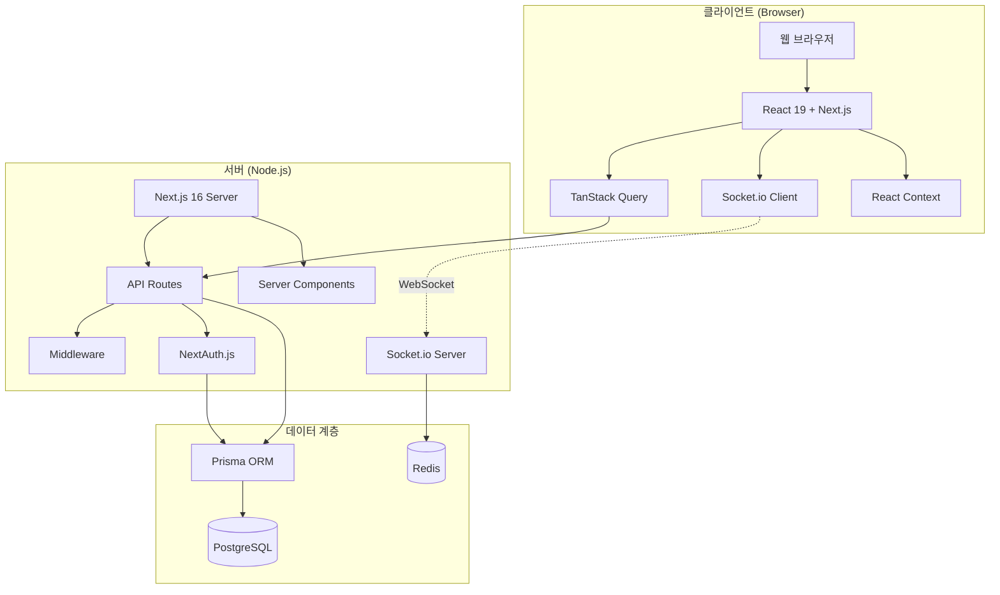
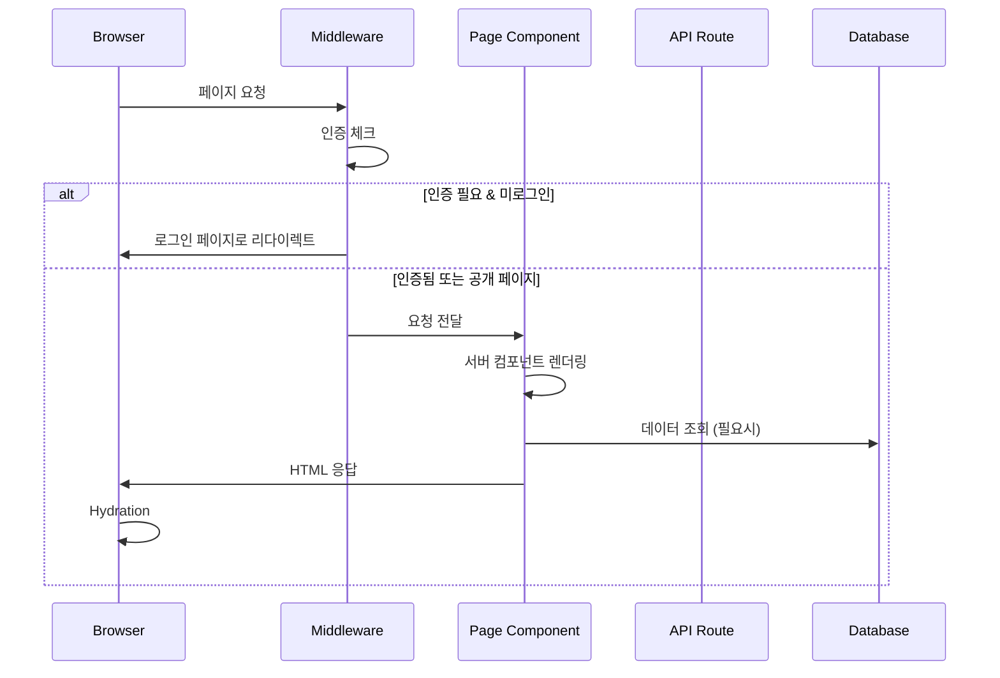
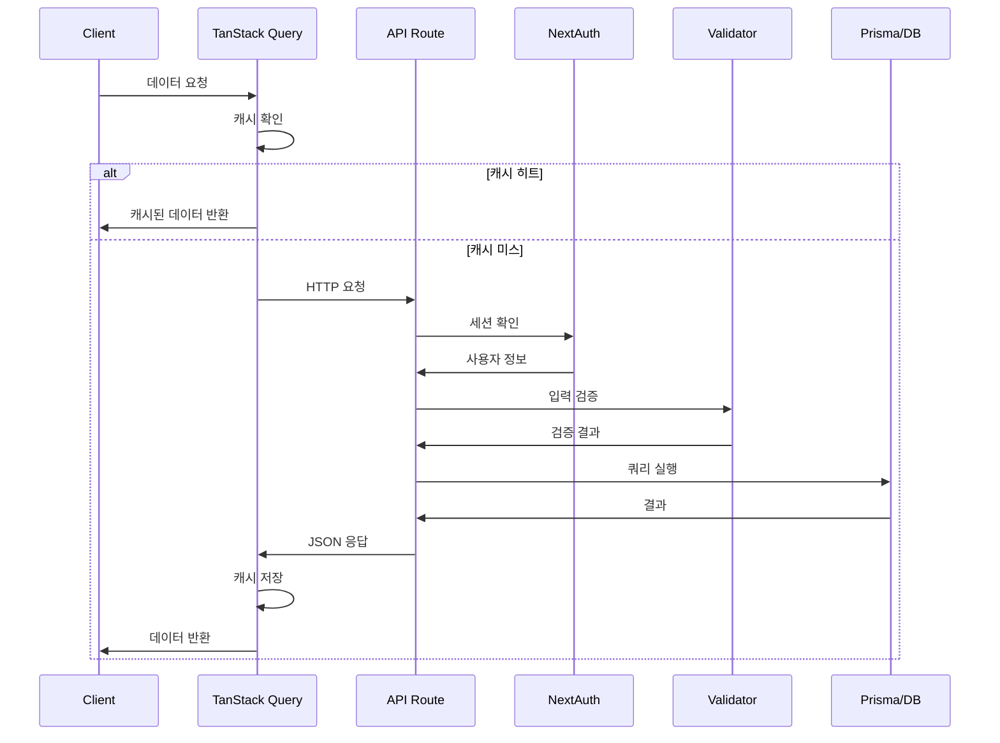

# 🏗️ 시스템 개요

## 📋 개요

CoUp은 Next.js 16 기반의 풀스택 웹 애플리케이션으로, 클라이언트와 서버가 하나의 프로젝트에 통합되어 있습니다. App Router를 사용하여 페이지와 API를 구성하고, Socket.io를 통해 실시간 통신을 지원합니다.

---

## 🏛️ 전체 시스템 아키텍처



---

## 🔧 핵심 컴포넌트

### 1. Next.js 서버

| 역할 | 설명 |
|------|------|
| **페이지 렌더링** | 서버/클라이언트 컴포넌트 렌더링 |
| **API 처리** | `/api/*` 경로의 RESTful API |
| **미들웨어** | 인증 체크, 라우팅 제어 |
| **정적 파일** | 이미지, CSS 등 정적 자산 제공 |

### 2. 커스텀 HTTP 서버 (server.mjs)

```javascript
// Next.js + Socket.io 통합 서버
import { createServer } from 'http'
import next from 'next'
import { initSocketServer } from './src/lib/socket/server.js'

const httpServer = createServer(...)
await initSocketServer(httpServer) // Socket.io 초기화
```

| 역할 | 설명 |
|------|------|
| **HTTP 서버** | Node.js HTTP 서버 |
| **Next.js 핸들러** | 페이지/API 요청 처리 |
| **Socket.io 서버** | 실시간 WebSocket 통신 |

### 3. 데이터베이스 (PostgreSQL + Prisma)

| 역할 | 설명 |
|------|------|
| **데이터 저장** | 모든 영구 데이터 저장 |
| **ORM** | Prisma로 타입 안전한 쿼리 |
| **마이그레이션** | 스키마 버전 관리 |

### 4. Redis

| 역할 | 설명 |
|------|------|
| **세션 스토어** | 사용자 세션 저장 |
| **Socket.io 어댑터** | 다중 서버 간 이벤트 동기화 |
| **캐싱** | 자주 조회되는 데이터 캐시 |

---

## 📁 계층 구조

```
┌─────────────────────────────────────────────────────────┐
│                    Presentation Layer                    │
│  (React Components, Pages, Layouts)                     │
├─────────────────────────────────────────────────────────┤
│                    Application Layer                     │
│  (API Routes, Server Actions, Middleware)               │
├─────────────────────────────────────────────────────────┤
│                    Domain Layer                          │
│  (Validators, Helpers, Business Logic)                  │
├─────────────────────────────────────────────────────────┤
│                    Infrastructure Layer                  │
│  (Prisma, Redis, Socket.io, NextAuth)                   │
├─────────────────────────────────────────────────────────┤
│                    Database Layer                        │
│  (PostgreSQL)                                           │
└─────────────────────────────────────────────────────────┘
```

### Presentation Layer
- React 컴포넌트 (`src/components/`)
- 페이지 (`src/app/*/page.js`)
- 레이아웃 (`src/app/*/layout.js`)
- 스타일 (`src/styles/`, `*.module.css`)

### Application Layer
- API Routes (`src/app/api/`)
- Middleware (`middleware.js`)
- Providers (`src/app/providers.js`)

### Domain Layer
- Validators (`src/lib/validators/`)
- Helpers (`src/lib/*-helpers.js`)
- Utilities (`src/utils/`)

### Infrastructure Layer
- Prisma Client (`src/lib/prisma.js`)
- Redis Client (`src/lib/redis.js`)
- Socket.io (`src/lib/socket/`)
- NextAuth (`src/lib/auth.js`)

---

## 🔄 요청 흐름

### 페이지 요청 흐름



### API 요청 흐름



---

## 🖥️ 서버 컴포넌트 vs 클라이언트 컴포넌트

### 서버 컴포넌트 (기본값)

| 특징 | 설명 |
|------|------|
| **렌더링** | 서버에서만 렌더링 |
| **데이터 페칭** | 직접 DB 조회 가능 |
| **번들 크기** | 클라이언트에 포함 안 됨 |
| **사용 사례** | 페이지 레이아웃, 정적 콘텐츠 |

```javascript
// 서버 컴포넌트 (기본)
export default async function StudyPage({ params }) {
  const study = await prisma.study.findUnique({
    where: { id: params.id }
  });
  
  return <div>{study.name}</div>;
}
```

### 클라이언트 컴포넌트 ('use client')

| 특징 | 설명 |
|------|------|
| **렌더링** | 클라이언트에서 렌더링 |
| **인터랙션** | 이벤트 핸들러, 상태 사용 가능 |
| **훅 사용** | useState, useEffect 등 |
| **사용 사례** | 폼, 채팅, 실시간 UI |

```javascript
'use client'

import { useState } from 'react';

export default function ChatInput() {
  const [message, setMessage] = useState('');
  
  return (
    <input 
      value={message} 
      onChange={(e) => setMessage(e.target.value)} 
    />
  );
}
```

### 하이브리드 패턴

```javascript
// 페이지 (서버 컴포넌트)
export default async function StudyPage({ params }) {
  const study = await getStudy(params.id); // 서버에서 데이터 로드
  
  return (
    <div>
      <StudyHeader study={study} />      {/* 서버 컴포넌트 */}
      <ChatSection studyId={study.id} /> {/* 클라이언트 컴포넌트 */}
    </div>
  );
}
```

---

## 🔌 외부 서비스 연동

| 서비스 | 용도 | 설정 |
|--------|------|------|
| **PostgreSQL** | 데이터 저장 | `DATABASE_URL` 환경변수 |
| **Redis** | 캐싱, Socket.io | `REDIS_URL` 환경변수 |
| **Signaling Server** | WebRTC 시그널링 | 별도 서버 (`signaling-server/`) |

---

## 🔗 관련 문서

- [데이터 흐름](./data-flow.md)
- [인증 흐름](./authentication-flow.md)
- [실시간 통신](./realtime-communication.md)
- [기술 스택](../01_overview/tech-stack.md)
