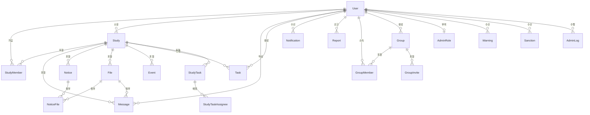
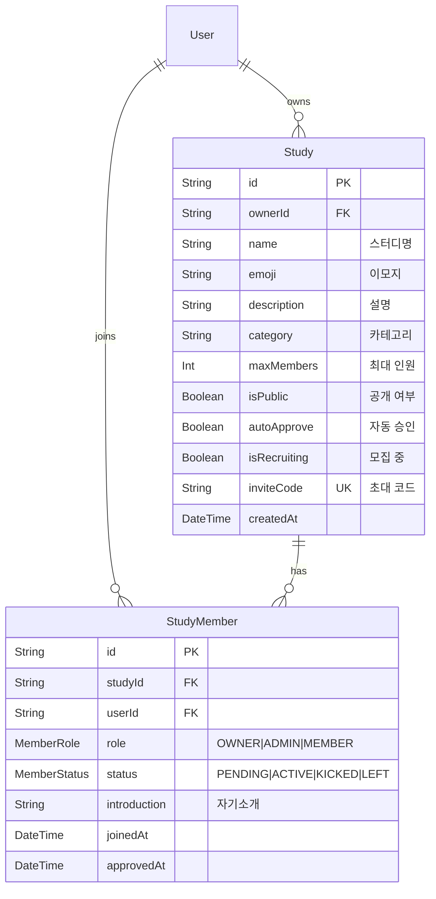
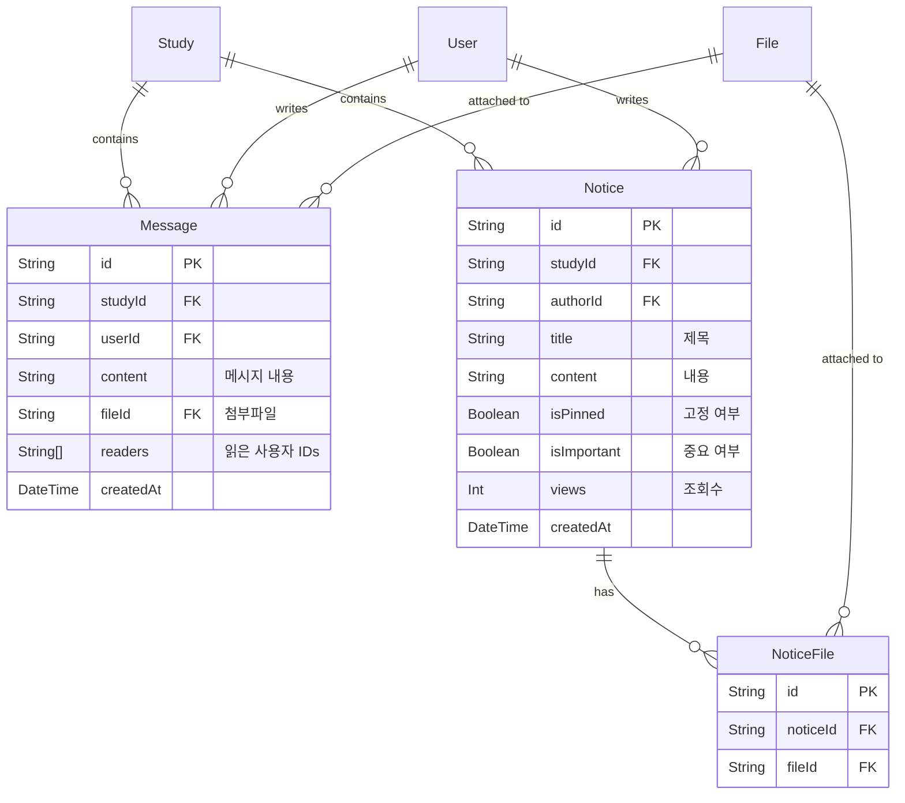
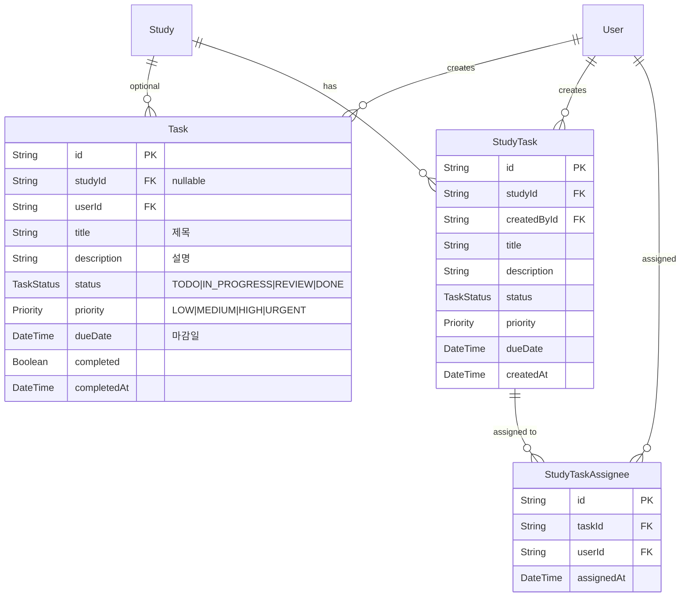
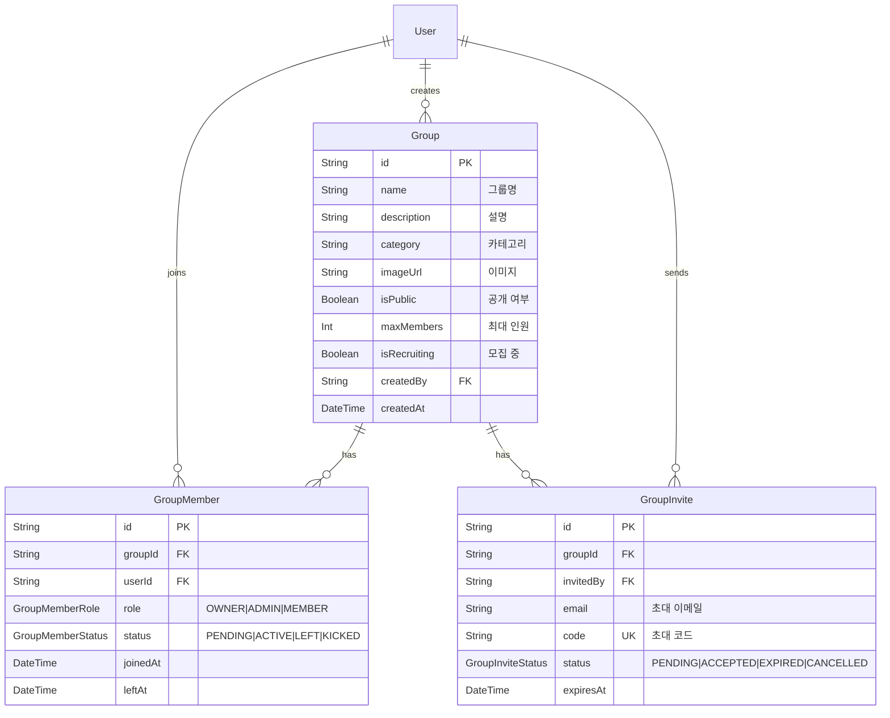
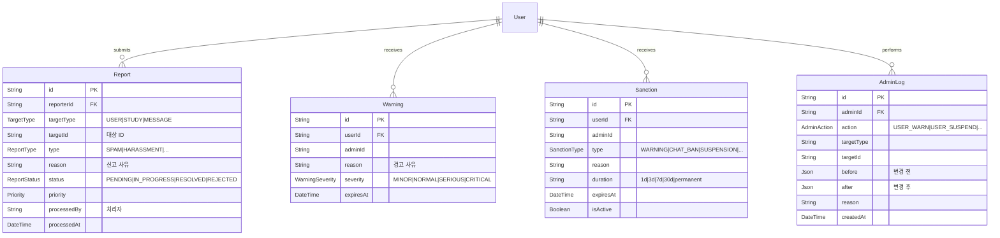
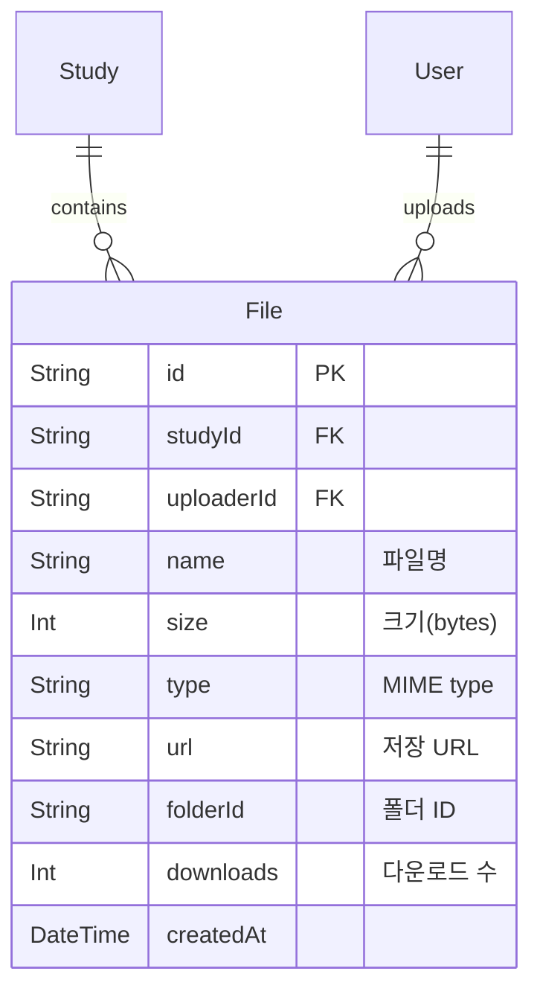
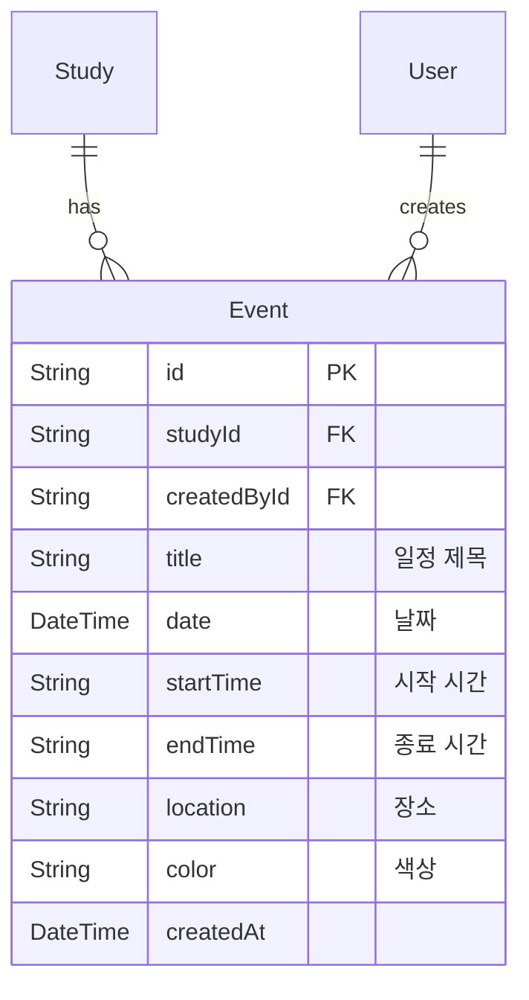
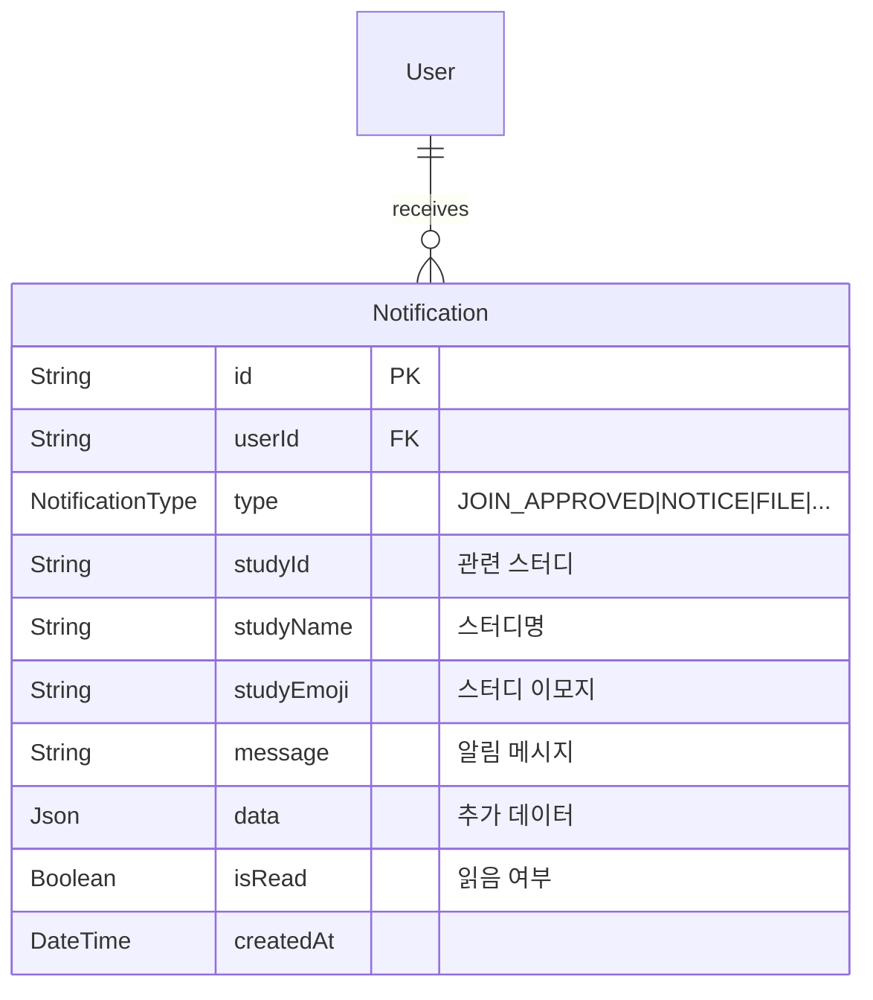

# 📊 ERD 다이어그램

## 📋 개요

이 문서는 CoUp 데이터베이스의 전체 ERD(Entity-Relationship Diagram)와 도메인별 부분 ERD를 제공합니다.

---

## 🗺️ 전체 ERD 개요



---

## 👤 사용자 도메인 ERD

```mermaid
erDiagram
    User {
        String id PK "cuid()"
        String email UK "이메일"
        String password "비밀번호 (nullable)"
        String name "이름"
        String avatar "프로필 이미지"
        String bio "자기소개"
        Provider provider "CREDENTIALS|GOOGLE|GITHUB"
        UserRole role "USER|ADMIN"
        UserStatus status "ACTIVE|SUSPENDED|DELETED"
        DateTime createdAt "생성일"
        DateTime lastLoginAt "마지막 로그인"
    }
    
    AdminRole {
        String id PK
        String userId FK UK
        AdminRoleType role "VIEWER|MODERATOR|ADMIN|SUPER_ADMIN"
        Json permissions "세부 권한"
        String grantedBy "부여한 관리자"
        DateTime grantedAt "부여일"
    }
    
    User ||--o| AdminRole : "has"
```

---

## 📖 스터디 도메인 ERD



---

## 💬 메시지 도메인 ERD



---

## ✅ 태스크 도메인 ERD



---

## 👥 그룹 도메인 ERD



---

## 🛡️ 관리자 도메인 ERD



---

## 📁 파일 도메인 ERD



---

## 📅 캘린더 도메인 ERD



---

## 🔔 알림 도메인 ERD



---

## 🔗 관련 문서

- [모델 상세](./models/)
- [테이블 관계](./relationships.md)
- [인덱스 최적화](./indexes-optimization.md)
