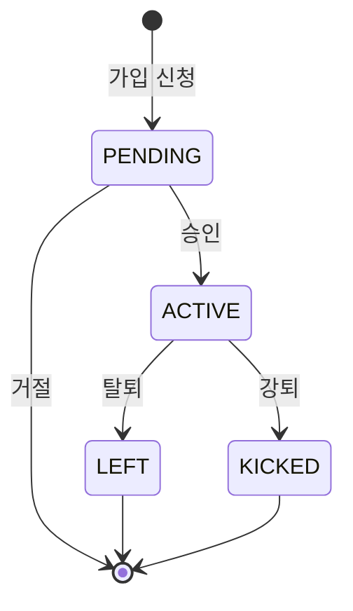

# 👥 StudyMember 모델

## 📋 개요

`StudyMember` 모델은 사용자(User)와 스터디(Study) 간의 다대다(N:M) 관계를 나타내는 연결 테이블입니다. 스터디 가입, 역할, 상태를 관리합니다.

---

## 📊 스키마 정의

```prisma
model StudyMember {
  id      String       @id @default(cuid())
  studyId String
  userId  String
  role    MemberRole   @default(MEMBER)
  status  MemberStatus @default(PENDING)

  // 가입 정보
  introduction String? @db.Text
  motivation   String?
  level        String?

  // 타임스탬프
  joinedAt   DateTime  @default(now())
  approvedAt DateTime?

  // 관계
  study Study @relation(fields: [studyId], references: [id], onDelete: Cascade)
  user  User  @relation(fields: [userId], references: [id], onDelete: Cascade)

  @@unique([studyId, userId])
  @@index([userId])
  @@index([status])
  @@index([studyId, status])
}
```

---

## 🏷️ 필드 상세

### 기본 정보

| 필드 | 타입 | 필수 | 기본값 | 설명 |
|------|------|------|--------|------|
| `id` | String | ✅ | cuid() | 고유 식별자 |
| `studyId` | String | ✅ | - | 스터디 ID (FK) |
| `userId` | String | ✅ | - | 사용자 ID (FK) |
| `role` | MemberRole | ✅ | MEMBER | 멤버 역할 |
| `status` | MemberStatus | ✅ | PENDING | 멤버십 상태 |

### 가입 정보

| 필드 | 타입 | 필수 | 기본값 | 설명 |
|------|------|------|--------|------|
| `introduction` | String | ❌ | null | 자기소개 |
| `motivation` | String | ❌ | null | 가입 동기 |
| `level` | String | ❌ | null | 실력 수준 |

### 타임스탬프

| 필드 | 타입 | 필수 | 기본값 | 설명 |
|------|------|------|--------|------|
| `joinedAt` | DateTime | ✅ | now() | 가입 신청일 |
| `approvedAt` | DateTime | ❌ | null | 승인일 |

---

## 🔗 관계 (Relations)

| 관계 | 대상 모델 | 관계 유형 | 설명 |
|------|----------|----------|------|
| `study` | Study | N:1 | 소속 스터디 |
| `user` | User | N:1 | 멤버 사용자 |

---

## 📌 Enum 타입

### MemberRole (멤버 역할)

| 값 | 설명 | 권한 |
|----|------|------|
| `OWNER` | 스터디장 | 모든 권한 (삭제, 양도 등) |
| `ADMIN` | 관리자 | 멤버 관리, 설정 변경 |
| `MEMBER` | 일반 멤버 | 참여, 채팅, 파일 업로드 |

### MemberStatus (멤버십 상태)

| 값 | 설명 |
|----|------|
| `PENDING` | 가입 승인 대기 중 |
| `ACTIVE` | 활성 멤버 |
| `KICKED` | 강퇴됨 |
| `LEFT` | 탈퇴함 |

---

## 🔍 인덱스

| 인덱스 | 필드 | 용도 |
|--------|------|------|
| `@@unique([studyId, userId])` | studyId, userId | 중복 가입 방지 |
| `@@index([userId])` | userId | 사용자의 스터디 목록 조회 |
| `@@index([status])` | status | 상태별 필터링 |
| `@@index([studyId, status])` | studyId, status | 스터디의 상태별 멤버 조회 |

---

## 🔄 멤버십 플로우



---

## 💡 사용 예시

### 스터디 가입 신청
```javascript
const membership = await prisma.studyMember.create({
  data: {
    studyId: 'study-id',
    userId: 'user-id',
    status: 'PENDING',
    introduction: '열심히 참여하겠습니다!',
    motivation: 'React를 배우고 싶어서',
    level: '초급',
  }
});
```

### 가입 승인
```javascript
await prisma.studyMember.update({
  where: {
    studyId_userId: {
      studyId: 'study-id',
      userId: 'user-id'
    }
  },
  data: {
    status: 'ACTIVE',
    approvedAt: new Date()
  }
});
```

### 스터디 활성 멤버 조회
```javascript
const members = await prisma.studyMember.findMany({
  where: {
    studyId: 'study-id',
    status: 'ACTIVE'
  },
  include: {
    user: {
      select: { id: true, name: true, avatar: true }
    }
  }
});
```

### 사용자의 가입 스터디 목록
```javascript
const myStudies = await prisma.studyMember.findMany({
  where: {
    userId: 'user-id',
    status: 'ACTIVE'
  },
  include: {
    study: true
  }
});
```

### 대기 중인 가입 신청 조회
```javascript
const pendingRequests = await prisma.studyMember.findMany({
  where: {
    studyId: 'study-id',
    status: 'PENDING'
  },
  include: {
    user: {
      select: { name: true, email: true, avatar: true }
    }
  },
  orderBy: { joinedAt: 'asc' }
});
```

---

## 🔗 관련 문서

- [사용자 모델](./user.md)
- [스터디 모델](./study.md)
- [그룹 모델](./group.md)
