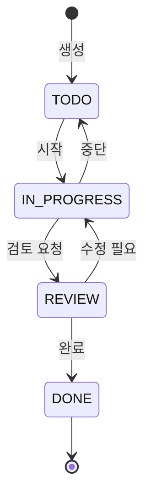

# ✅ Task 모델

## 📋 개요

CoUp에는 두 가지 태스크 모델이 있습니다:
- **Task**: 개인용 할 일 (스터디 연결 선택적)
- **StudyTask**: 스터디 공유용 할 일 (담당자 배정 가능)

---

## 📊 스키마 정의

### Task (개인 할 일)

```prisma
model Task {
  id          String     @id @default(cuid())
  studyId     String?
  userId      String
  title       String
  description String?    @db.Text
  status      TaskStatus @default(TODO)
  priority    Priority   @default(MEDIUM)
  dueDate     DateTime?

  completed   Boolean   @default(false)
  completedAt DateTime?

  createdAt DateTime @default(now())

  user  User   @relation(fields: [userId], references: [id])
  study Study? @relation(fields: [studyId], references: [id], onDelete: Cascade)

  @@index([userId, completed])
  @@index([studyId, status])
}
```

### StudyTask (스터디 공유 할 일)

```prisma
model StudyTask {
  id          String     @id @default(cuid())
  studyId     String
  createdById String
  title       String
  description String?    @db.Text
  status      TaskStatus @default(TODO)
  priority    Priority   @default(MEDIUM)
  dueDate     DateTime?

  createdAt DateTime @default(now())
  updatedAt DateTime @updatedAt

  study     Study               @relation(...)
  createdBy User                @relation(...)
  assignees StudyTaskAssignee[]

  @@index([studyId, status])
  @@index([createdById])
}
```

### StudyTaskAssignee (태스크 담당자)

```prisma
model StudyTaskAssignee {
  id     String @id @default(cuid())
  taskId String
  userId String

  assignedAt DateTime @default(now())

  task StudyTask @relation(...)
  user User      @relation(...)

  @@unique([taskId, userId])
  @@index([userId])
}
```

---

## 🏷️ Task 필드 상세

| 필드 | 타입 | 필수 | 기본값 | 설명 |
|------|------|------|--------|------|
| `id` | String | ✅ | cuid() | 고유 식별자 |
| `studyId` | String | ❌ | null | 연결된 스터디 ID |
| `userId` | String | ✅ | - | 생성자 ID |
| `title` | String | ✅ | - | 할 일 제목 |
| `description` | String | ❌ | null | 상세 설명 |
| `status` | TaskStatus | ✅ | TODO | 진행 상태 |
| `priority` | Priority | ✅ | MEDIUM | 우선순위 |
| `dueDate` | DateTime | ❌ | null | 마감일 |
| `completed` | Boolean | ✅ | false | 완료 여부 |
| `completedAt` | DateTime | ❌ | null | 완료 시간 |

---

## 🏷️ StudyTask 필드 상세

| 필드 | 타입 | 필수 | 기본값 | 설명 |
|------|------|------|--------|------|
| `id` | String | ✅ | cuid() | 고유 식별자 |
| `studyId` | String | ✅ | - | 스터디 ID |
| `createdById` | String | ✅ | - | 생성자 ID |
| `title` | String | ✅ | - | 할 일 제목 |
| `description` | String | ❌ | null | 상세 설명 |
| `status` | TaskStatus | ✅ | TODO | 진행 상태 |
| `priority` | Priority | ✅ | MEDIUM | 우선순위 |
| `dueDate` | DateTime | ❌ | null | 마감일 |

---

## 📌 Enum 타입

### TaskStatus (진행 상태)

| 값 | 설명 | 색상 예시 |
|----|------|----------|
| `TODO` | 할 일 (시작 전) | 🔵 파란색 |
| `IN_PROGRESS` | 진행 중 | 🟡 노란색 |
| `REVIEW` | 검토 중 | 🟣 보라색 |
| `DONE` | 완료 | 🟢 녹색 |

### Priority (우선순위)

| 값 | 설명 | 색상 예시 |
|----|------|----------|
| `LOW` | 낮음 | 🔵 파란색 |
| `MEDIUM` | 보통 | 🟡 노란색 |
| `HIGH` | 높음 | 🟠 주황색 |
| `URGENT` | 긴급 | 🔴 빨간색 |

---

## 🔄 태스크 상태 플로우



---

## 🔍 인덱스

### Task 인덱스

| 인덱스 | 필드 | 용도 |
|--------|------|------|
| `@@index([userId, completed])` | userId, completed | 개인 할 일 목록 조회 |
| `@@index([studyId, status])` | studyId, status | 스터디별 상태별 조회 |

### StudyTask 인덱스

| 인덱스 | 필드 | 용도 |
|--------|------|------|
| `@@index([studyId, status])` | studyId, status | 스터디별 상태별 조회 |
| `@@index([createdById])` | createdById | 생성자별 조회 |

---

## 💡 사용 예시

### 개인 할 일 생성
```javascript
const task = await prisma.task.create({
  data: {
    userId: 'user-id',
    title: 'React 강의 수강하기',
    description: 'Udemy React 완벽 가이드 섹션 5까지',
    priority: 'HIGH',
    dueDate: new Date('2026-02-15'),
  }
});
```

### 스터디 태스크 생성 (담당자 배정)
```javascript
const studyTask = await prisma.studyTask.create({
  data: {
    studyId: 'study-id',
    createdById: 'user-id',
    title: '프로젝트 README 작성',
    description: '프로젝트 설명, 설치 방법, 사용법 포함',
    priority: 'MEDIUM',
    dueDate: new Date('2026-02-10'),
    assignees: {
      create: [
        { userId: 'user-1' },
        { userId: 'user-2' },
      ]
    }
  },
  include: { assignees: { include: { user: true } } }
});
```

### 내 할 일 목록 조회
```javascript
const myTasks = await prisma.task.findMany({
  where: {
    userId: 'user-id',
    completed: false,
  },
  orderBy: [
    { priority: 'desc' },
    { dueDate: 'asc' }
  ]
});
```

### 스터디 태스크 목록 (상태별)
```javascript
const tasks = await prisma.studyTask.findMany({
  where: { studyId: 'study-id' },
  include: {
    createdBy: { select: { name: true, avatar: true } },
    assignees: {
      include: {
        user: { select: { name: true, avatar: true } }
      }
    }
  },
  orderBy: { createdAt: 'desc' }
});

// 상태별 그룹화
const grouped = {
  TODO: tasks.filter(t => t.status === 'TODO'),
  IN_PROGRESS: tasks.filter(t => t.status === 'IN_PROGRESS'),
  REVIEW: tasks.filter(t => t.status === 'REVIEW'),
  DONE: tasks.filter(t => t.status === 'DONE'),
};
```

### 태스크 상태 변경
```javascript
await prisma.studyTask.update({
  where: { id: 'task-id' },
  data: { status: 'DONE' }
});
```

---

## 🔗 관련 문서

- [스터디 모델](./study.md)
- [사용자 모델](./user.md)
- [알림 모델](./notification.md)
