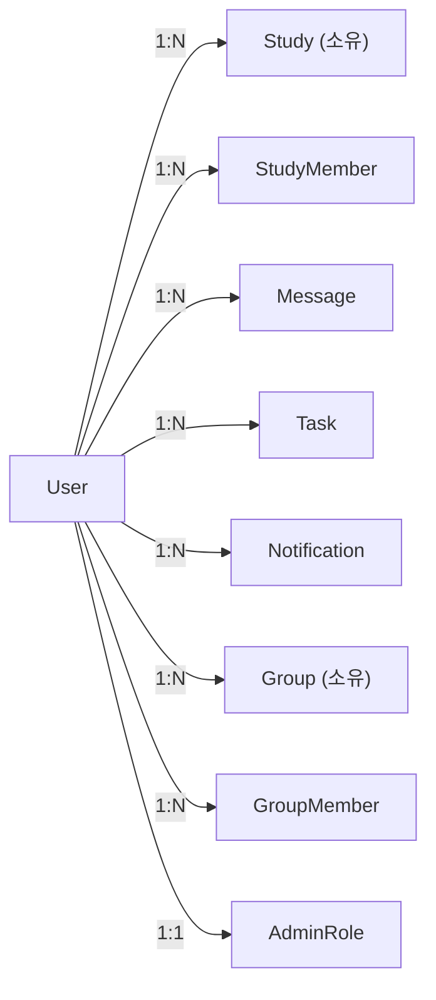
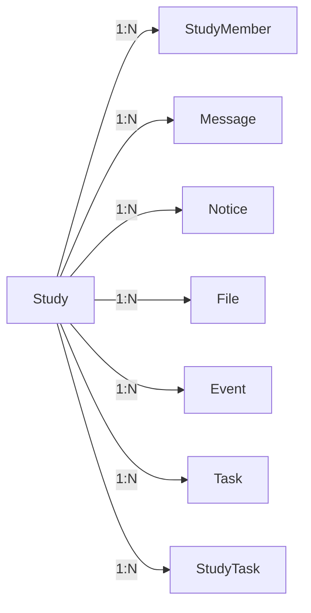
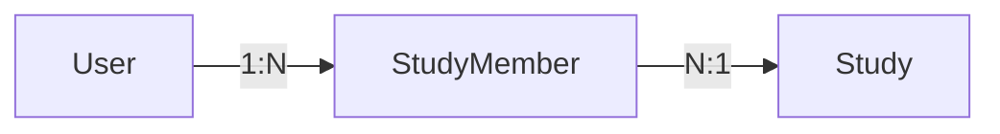
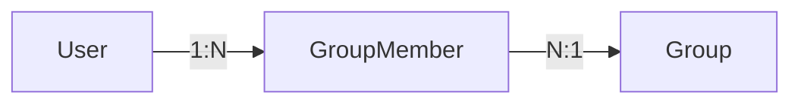
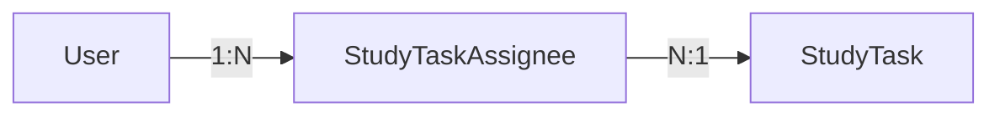
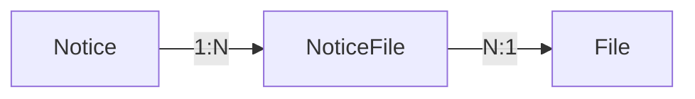

# 🔗 테이블 관계 (Relationships)

## 📋 개요

이 문서는 CoUp 데이터베이스의 테이블 간 관계를 상세히 설명합니다. 관계 유형, 외래 키, 캐스케이드 정책을 포함합니다.

---

## 📊 관계 유형 설명

| 유형 | 표기 | 설명 | 예시 |
|------|------|------|------|
| **1:1** | One-to-One | 하나의 레코드가 다른 테이블의 하나의 레코드와 연결 | User ↔ AdminRole |
| **1:N** | One-to-Many | 하나의 레코드가 다른 테이블의 여러 레코드와 연결 | User → StudyMember[] |
| **N:M** | Many-to-Many | 연결 테이블을 통한 다대다 관계 | User ↔ Study (via StudyMember) |

---

## 👤 User 중심 관계



### User → Study (소유)
- **관계 유형**: 1:N
- **설명**: 사용자가 생성한(소유한) 스터디
- **외래 키**: `Study.ownerId → User.id`
- **캐스케이드**: 없음 (사용자 삭제 시 스터디 유지)

### User → StudyMember
- **관계 유형**: 1:N
- **설명**: 사용자의 스터디 멤버십 목록
- **외래 키**: `StudyMember.userId → User.id`
- **캐스케이드**: `onDelete: Cascade` (사용자 삭제 시 멤버십 삭제)

### User → Notification
- **관계 유형**: 1:N
- **설명**: 사용자가 받은 알림
- **외래 키**: `Notification.userId → User.id`
- **캐스케이드**: `onDelete: Cascade` (사용자 삭제 시 알림 삭제)

### User ↔ AdminRole
- **관계 유형**: 1:1
- **설명**: 사용자의 관리자 역할 (있는 경우)
- **외래 키**: `AdminRole.userId → User.id` (unique)
- **캐스케이드**: `onDelete: Cascade`

---

## 📖 Study 중심 관계



### Study → StudyMember
- **관계 유형**: 1:N
- **설명**: 스터디의 멤버 목록
- **외래 키**: `StudyMember.studyId → Study.id`
- **캐스케이드**: `onDelete: Cascade` (스터디 삭제 시 멤버십 삭제)

### Study → Message
- **관계 유형**: 1:N
- **설명**: 스터디 채팅 메시지
- **외래 키**: `Message.studyId → Study.id`
- **캐스케이드**: `onDelete: Cascade`

### Study → File
- **관계 유형**: 1:N
- **설명**: 스터디에 업로드된 파일
- **외래 키**: `File.studyId → Study.id`
- **캐스케이드**: `onDelete: Cascade`

---

## 👥 N:M 관계 (연결 테이블)

### User ↔ Study (via StudyMember)



- **연결 테이블**: `StudyMember`
- **유니크 제약**: `@@unique([studyId, userId])`
- **추가 필드**: `role`, `status`, `introduction`, `joinedAt`

### User ↔ Group (via GroupMember)



- **연결 테이블**: `GroupMember`
- **유니크 제약**: `@@unique([groupId, userId])`
- **추가 필드**: `role`, `status`, `joinedAt`

### User ↔ StudyTask (via StudyTaskAssignee)



- **연결 테이블**: `StudyTaskAssignee`
- **유니크 제약**: `@@unique([taskId, userId])`
- **추가 필드**: `assignedAt`

### Notice ↔ File (via NoticeFile)



- **연결 테이블**: `NoticeFile`
- **유니크 제약**: `@@unique([noticeId, fileId])`

---

## 🔄 캐스케이드 정책 요약

| 부모 테이블 | 자식 테이블 | 캐스케이드 | 설명 |
|-------------|------------|------------|------|
| User | StudyMember | Cascade | 사용자 삭제 시 멤버십 삭제 |
| User | Notification | Cascade | 사용자 삭제 시 알림 삭제 |
| User | GroupMember | Cascade | 사용자 삭제 시 그룹 멤버십 삭제 |
| User | Warning | Cascade | 사용자 삭제 시 경고 삭제 |
| User | AdminRole | Cascade | 사용자 삭제 시 관리자 역할 삭제 |
| Study | StudyMember | Cascade | 스터디 삭제 시 멤버십 삭제 |
| Study | Message | Cascade | 스터디 삭제 시 메시지 삭제 |
| Study | Notice | Cascade | 스터디 삭제 시 공지 삭제 |
| Study | File | Cascade | 스터디 삭제 시 파일 삭제 |
| Study | Event | Cascade | 스터디 삭제 시 일정 삭제 |
| Study | Task | Cascade | 스터디 삭제 시 태스크 삭제 |
| Study | StudyTask | Cascade | 스터디 삭제 시 스터디 태스크 삭제 |
| StudyTask | StudyTaskAssignee | Cascade | 태스크 삭제 시 담당자 삭제 |
| Group | GroupMember | Cascade | 그룹 삭제 시 멤버십 삭제 |
| Group | GroupInvite | Cascade | 그룹 삭제 시 초대 삭제 |
| Notice | NoticeFile | Cascade | 공지 삭제 시 첨부 삭제 |
| File | NoticeFile | Cascade | 파일 삭제 시 공지 첨부 삭제 |

---

## ⚠️ 주의사항

### 1. 순환 참조 방지
- User → Study (소유)와 Study → User (멤버)는 서로 다른 관계
- 명시적 관계명 사용: `@relation("StudyOwner")`, `@relation("FileUploader")`

### 2. Soft Delete 고려
- `Group.deletedAt` 필드로 소프트 삭제 구현
- 실제 삭제 대신 `deletedAt` 타임스탬프 설정

### 3. 데이터 무결성
- 외래 키 제약조건으로 존재하지 않는 참조 방지
- 유니크 제약조건으로 중복 방지

---

## 💡 관계 조회 예시

### 스터디와 모든 관련 데이터 조회
```javascript
const study = await prisma.study.findUnique({
  where: { id: 'study-id' },
  include: {
    owner: { select: { name: true, avatar: true } },
    members: {
      where: { status: 'ACTIVE' },
      include: { user: { select: { name: true, avatar: true } } }
    },
    messages: { take: 50, orderBy: { createdAt: 'desc' } },
    notices: { where: { isPinned: true } },
    events: { where: { date: { gte: new Date() } } },
    studyTasks: {
      include: { assignees: { include: { user: true } } }
    },
    _count: {
      select: { members: true, messages: true, files: true }
    }
  }
});
```

### 사용자의 모든 스터디 관련 데이터
```javascript
const userData = await prisma.user.findUnique({
  where: { id: 'user-id' },
  include: {
    ownedStudies: true,
    studyMembers: {
      where: { status: 'ACTIVE' },
      include: { study: true }
    },
    notifications: {
      where: { isRead: false },
      take: 10
    },
    assignedStudyTasks: {
      include: { task: true }
    }
  }
});
```

---

## 🔗 관련 문서

- [ERD 다이어그램](./erd-diagram.md)
- [인덱스 최적화](./indexes-optimization.md)
- [모델 상세](./models/)
